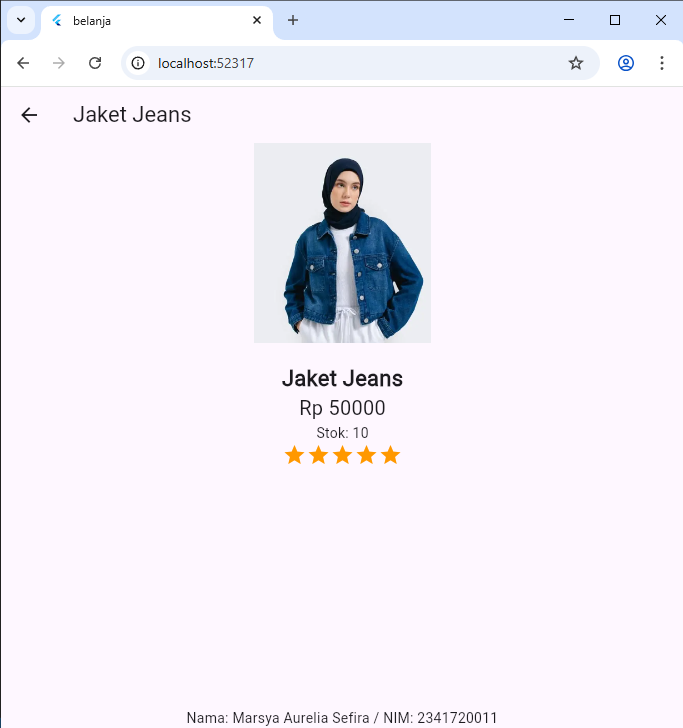

# Pemograman Mobile Week 06

Nama : Marsya Aurelia Sefira

Kelas : 3G

NIM : 2341720011

# Praktikum 1 : Membangun Layout di Flutter

Gambar diatas adalah hasil pengimplementasian project baru dengan mengidentifikasi layout diagram, diserta dengan widget menggunakan title row. 

# Praktikum 2 : Implementasi button row

Gambar diatas adalah hasil implementasi method buildButtonColumn, dan membuat widget buttonSection, kemudian menambahkan button section tersebut ke body

# Praktikum 3 : Implementasi text section

Gambar diatas adalah hasil implementasi membuat widget textSection, kemudian menambahkan variabel textSection ke body

# Praktikum 4 : Implementasi image section

Gambar diatas adalah hasil implementasi menambahkan asset gambar, kemudian menambahkan gambar ke bagian body dengan menggunakan ListView

# Tugas Praktikum 1 : Membuat Project Baru "basic_layout_flutter"

Halaman Home

Halaman Image Column

Halaman Grid

Halaman List

Halaman Card 

Halaman Ratings

# Praktikum 5 : Membangun Navigasi di Flutter

Saat nama produk di klik, makan akan ditampilkan sebagai berikut

Gambar diatas adalah hasil implementasi membangun navigasi di flutter, mulai dari mendefinisikan route, membuat data model, membuat ListView dan itemBuilder dan menambahkan aksi pada ListView menggunakan InkWell

# Tugas Praktikum 2

Daftar produk katalog pada aplikasi belanja yang telah saya buat

Ketika salah satu produk di klik, maka akan ditampilkan rincian produk sebagai berikut

