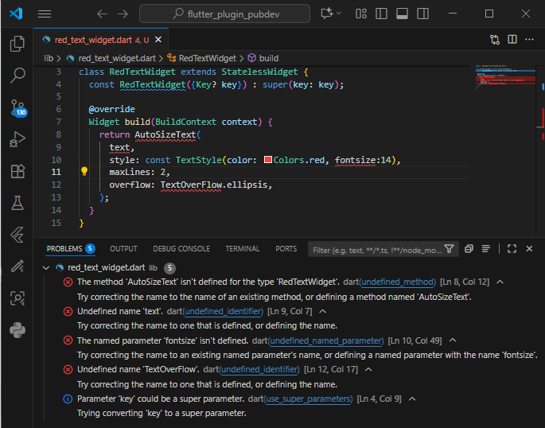
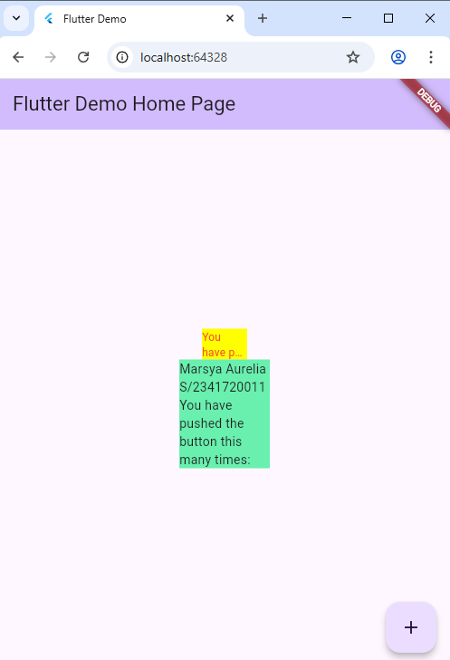

# PEMROGRAMAN MOBILE WEEK 07

Nama : Marsya Aurelia Sefira

Kelas : 3G

NIM : 2341720011

# Praktikum 

Langkah 4 : Error

Penjelasan :  Kode program pada gambar diatas error karena belum mengimpor package auto_size_text, widget ini berasal dari package eksternal, variabel 'text' belum dideklarasikan,  terdapat salah penulisan kode / typo di beberapa baris.

Hasil Output Praktikum

Gambar diatas adalah hasil praktikum manajemen plugin di project flutter.

# Tugas Praktikum

1. Selesaikan Praktikum tersebut, lalu dokumentasikan dan push ke repository Anda berupa screenshot hasil pekerjaan beserta penjelasannya di file README.md!

Jawaban : Dokumentasi praktikum telah tertera diatas.

2. Jelaskan maksud dari langkah 2 pada praktikum tersebut!

Jawaban : Langkah 2 berisi perintah 

flutter pub add auto_size_text

Langkah tersebut dilakukan untuk menambahkan plugin eksternal bernama auto_size_text ke dalam proyek flutter. Setelah dijalankan flutter akan mengunduh plugin auto_size_text dari pub.dev, kemudian otomatis akan menambahkan entri di file pubspec.yaml.

3. Jelaskan maksud dari langkah 5 pada praktikum tersebut!

Jawaban : Langkah 5 berisi kode

final String text;

const RedTextWidget({Key? key, required this.text}) : super(key: key);

Langkah tersebut mendeklarasikan sebuah variabel bernama text di dalam class RedTextWidget dengan tipe data string. Kode itu menyimpan teks yang dikirim dari luar (final string text), membuat constructor agar saat widget dipanggil, kita bisa memberi teks (required this.text), menyertakan key untuk sistem Flutter (super(key: key)).

4. Pada langkah 6 terdapat dua widget yang ditambahkan, jelaskan fungsi dan perbedaannya!

Jawaban : Langkah 6 berisi potongan kode

Container(
   color: Colors.yellowAccent,
   width: 50,
   child: const RedTextWidget(
             text: 'You have pushed the button this many times:',
          ),
),
Container(
    color: Colors.greenAccent,
    width: 100,
    child: const Text(
           'You have pushed the button this many times:',
          ),
),

Widget pertama berfungsi untuk menampilkan teks dengan widget khusus buatan sendiri (RedTextWidget), ukuran teks akan menyesuaikan secara otomatis dengan lebar container supaya tidak terpotong, warna teks diatur menjadi merah, maksimal dua bariss, jika teks terlalu panjang akan muncul tanda elipsis ...

Widget kedua berfungsi untuk menampilkan teks biasa menggunakan widget bawaan Flutter (Text), tidak otomatis menyesuaikan ukuran tulisan jika ruangnya sempit, teks bisa terpotong atau overflow, bertujuan menampilkan teks standar tanpa pengaturan tambahan

5. Jelaskan maksud dari tiap parameter yang ada di dalam plugin auto_size_text berdasarkan tautan pada dokumentasi ini !

Jawaban : 

key* => Key standar Flutter untuk widget, digunakan agar framework bisa membedakan widget ketika rebuild.

textKey => Key khusus untuk Text internal yang dibuat di dalam AutoSizeText.

style* => Style teks (mis. fontSize awal, warna, fontWeight, dsb.). Nilai fontSize di sini menjadi titik awal untuk penyesuaian ukuran teks.

minFontSize => Ukuran font terkecil yang boleh dipakai ketika teks disusutkan agar muat. Jika teks masih tidak muat saat font telah disusutkan ke minFontSize, maka pengaturan overflow akan berlaku.

maxFontSize => Batasi ukuran font maksimal ketika teks tumbuh. Ini berguna jika style dari atas mewarisi ukuran font besar, agar tidak melewati batas tertentu.

stepGranularity => Ukuran langkah (step) ketika sistem mencoba mengecilkan ukuran font agar pas. Semakin kecil nilai ini, makin halus penyesuaiannya, tapi makin banyak percobaan yang dilakukan (mungkin berdampak performa).

presetFontSizes => Jika disetel, hanya ukuran font dari daftar ini yang akan digunakan (alias pilihan preset). Bila parameter ini dipakai, maka minFontSize, maxFontSize, dan stepGranularity akan diabaikan.

group => Untuk menyinkronkan ukuran font dari banyak AutoSizeText agar mereka punya ukuran font yang sama (menyesuaikan anggota yang paling kecil).

textAlign* => Penataan horizontal teks (kiri, tengah, kanan, justified) sama seperti Text.

textDirection* => Arah teks (LTR atau RTL), memengaruhi interpretasi TextAlign.start / end.

locale* => Lokalisasi teks (mis. untuk memilih font tertentu berdasarkan locale).

softWrap* => Teks boleh dibungkus di break lembut (soft line break).

wrapWords => Kata yang tidak muat di satu baris boleh dipisah atau tidak. Bila false, kata harus dipertahankan utuh (tidak “dipatahkan”).

overflow* => Teks ditangani jika tetap melebihi batas setelah skala: bisa ellipsis, fade, clip, dsb.

overflowReplacement => Jika teks masih overflow setelah diskalakan ke minFontSize, widget ini ditampilkan sebagai pengganti agar teks tidak jadi sangat kecil atau tidak terbaca.

textScaleFactor* => Faktor skala teks (sering terkait dengan skala font sistem). Mempengaruhi perhitungan minFontSize, maxFontSize, dan preset sizes.

maxLines => Batas baris maksimum teks. Itu penting agar AutoSizeText tahu batas vertikal agar dapat mengecilkan font agar sesuai dalam jumlah baris tersebut.

semanticsLabel* => Label alternatif untuk aksesibilitas (screen reader), jika ingin teks berbeda dari yang tampil.

6. Kumpulkan laporan praktikum Anda berupa link repository GitHub kepada dosen!

Jawaban : Link repository ini sudah dikirim di google classroom