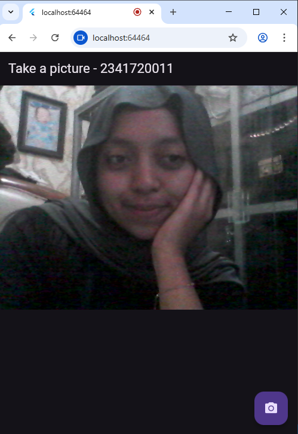
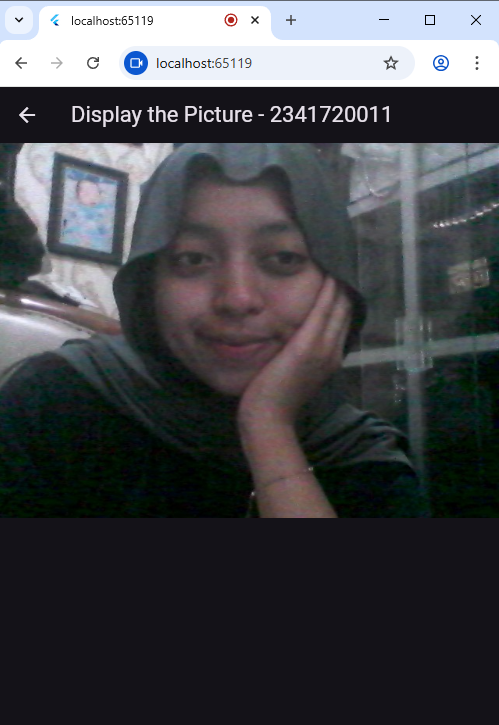
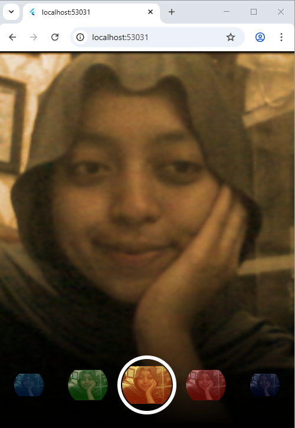
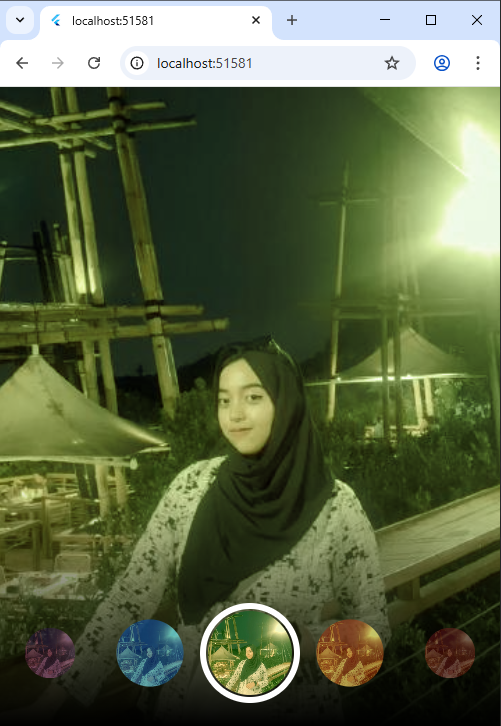

# Pemrograman Mobile Week 09

Nama : Marsya Aurelia Sefira

Kelas : 3G

NIM : 2341720011

# Tugas Praktikum 

1. Selesaikan Praktikum 1 dan 2, lalu dokumentasikan dan push ke repository Anda berupa screenshot setiap hasil pekerjaan beserta penjelasannya di file README.md! Jika terdapat error atau kode yang tidak dapat berjalan, silakan Anda perbaiki sesuai tujuan aplikasi dibuat!

Jawaban : 

# Praktikum 1

Take a Picture

Display a Picture

# Praktikum 2

Menggunakan hasil gambar dari praktikum 1

Mencoba menggunakan gambar lain

2. Gabungkan hasil praktikum 1 dengan hasil praktikum 2 sehingga setelah melakukan pengambilan foto, dapat dibuat filter carouselnya!

Jawaban : 

Hasil Gambar dari Praktikum 1

Gambar dengan filter carousel

3. Jelaskan maksud void async pada praktikum 1?

Jawaban : void async dibuat karena perlu menjalankan fungsi asinkron didalamnya yakni await availableCameras(), tanpa async flutter tidak bisa menunggu proses inisialisasi kamera selesai, sehingga dapat menyebabkan error.

4. Jelaskan fungsi dari anotasi @immutable dan @override ?

Jawaban : fungsi dari @immutable adalah untuk menandai bahwa kelas tidak boleh diubah setelah dibuat, semua field di dalam class harus final, tujuannya untuk mencegah perubahan data tak sengaja, dan membuat widget lebih efisien

fungsi dari @override adalah untuk menandai bahwa kita sedang menimpa sebuah method dari kelas induk (superclass), tujuannya untuk meningkatkan keamanan dan keterbacaan kode, serta memberi tahu compiler bahwa method ini menimpa method induknya

5. Kumpulkan link commit repository GitHub Anda kepada dosen yang telah disepakati!

Jawaban : Link repository Github ini akan disubmit di google classroom