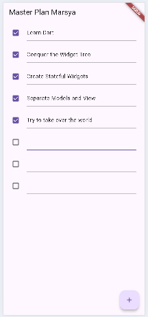

# Pemrograman Mobile Week 10

Nama : Marsya Aurelia Sefira

Kelas : 3G

NIM : 2341720011

# Praktikum 1 : Dasar State dengan Model-View

Hasil output praktikum 1

# Tugas Praktikum 1

1. Hasil output praktikum 1

Penjelasan : Pada gambar diatas menghasilkan output Master Plan Marsya, dimana pengguna dapat menambahkan plan baru untuk menandai tugas. Aplikasi ini dihasilkan dari struktur folder terpisah antara models dan views. Folder models berisi logika seperti kelas Plan dan Task yang mengatur struktur rencana dan daftar tugas. Sedangkan folder views berisi tampilan seperti plan_creator_screen.dart dan plan_screen.dart.

2. Jelaskan maksud dari langkah 4 pada praktikum tersebut! Mengapa dilakukan demikian?

Jawaban : membuat file data_layer.dart yang berfungsi sebagai penghubung utama antara file model di folder models, file ini menyederhanakan manajemen model, serta memperingkas kode, jadi import untuk models, bisa import data_layer.dart tanpa perlu mengimport banyak file models yang tersedia.

3. Mengapa perlu variabel plan di langkah 6 pada praktikum tersebut? Mengapa dibuat konstanta ?

Jawaban : variabel plan dibuat untuk menyimpan data plan dan daftar task yang akan ditampilkan, dibuat sebagai konstanta karena data awalnya masih kosong, hal ini dilakukan agar menunjukkan bahwa data belum dimodifikasi dan efisien memori.

4. Hasil dari langkah 9 dengan penjelasannya 

Jawaban : Hasilnya sama dengan gambar hasil praktikum 1 diatas, kode pada langkah 9 menghasilkan satu item task dalam bentuk list tile yang bisa diedit dan diberi centang pada checkboxnya.

5. Apa kegunan method pada langkah 11 dan 13 dalam lifecycle state? 

Jawaban : Langkah 11 method initState() digunakan untuk menginisialisasi dan pada langkah 13 method dispose digunakan untuk membersihkan ketika widget masuk dan keluar.

6. Kumpulkan link commit => akan dikumpulkan di classroom

