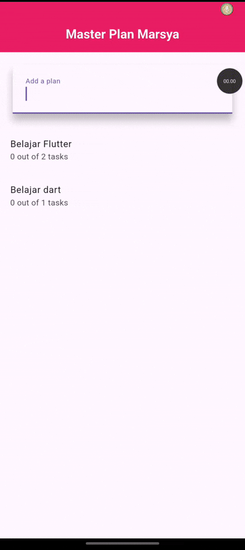

# Pemrograman Mobile Week 10

Nama : Marsya Aurelia Sefira

Kelas : 3G

NIM : 2341720011

# Praktikum 1 : Dasar State dengan Model-View

Hasil output praktikum 1

# Tugas Praktikum 1

1. Hasil output praktikum 1

Penjelasan : Pada gambar diatas menghasilkan output Master Plan Marsya, dimana pengguna dapat menambahkan plan baru untuk menandai tugas. Aplikasi ini dihasilkan dari struktur folder terpisah antara models dan views. Folder models berisi logika seperti kelas Plan dan Task yang mengatur struktur rencana dan daftar tugas. Sedangkan folder views berisi tampilan seperti plan_creator_screen.dart dan plan_screen.dart.

2. Jelaskan maksud dari langkah 4 pada praktikum tersebut! Mengapa dilakukan demikian?

Jawaban : membuat file data_layer.dart yang berfungsi sebagai penghubung utama antara file model di folder models, file ini menyederhanakan manajemen model, serta memperingkas kode, jadi import untuk models, bisa import data_layer.dart tanpa perlu mengimport banyak file models yang tersedia.

3. Mengapa perlu variabel plan di langkah 6 pada praktikum tersebut? Mengapa dibuat konstanta ?

Jawaban : variabel plan dibuat untuk menyimpan data plan dan daftar task yang akan ditampilkan, dibuat sebagai konstanta karena data awalnya masih kosong, hal ini dilakukan agar menunjukkan bahwa data belum dimodifikasi dan efisien memori.

4. Hasil dari langkah 9 dengan penjelasannya 

Jawaban : Hasilnya sama dengan gambar hasil praktikum 1 diatas, kode pada langkah 9 menghasilkan satu item task dalam bentuk list tile yang bisa diedit dan diberi centang pada checkboxnya.

5. Apa kegunan method pada langkah 11 dan 13 dalam lifecycle state? 

Jawaban : Langkah 11 method initState() digunakan untuk menginisialisasi dan pada langkah 13 method dispose digunakan untuk membersihkan ketika widget masuk dan keluar.

6. Kumpulkan link commit => akan dikumpulkan di classroom

# Praktikum 2 : Mengelola Data Layer dengan InheritedWidget dan InheritedNotifier

Hasil output praktikum 2

1. Penjelasan hasil output praktikum 2 : Pada gambar diatas tampilannya sama dengan hasil praktikum 1, yang membedakan adalah penambahan struktur folder provider yang digunakan untuk mengatur perubahan data secara reaktif, dipisah menggunakan folder provider agar lebih efisien dan terpisah dari tampilan.

2. Jelaskan mana yang dimaksud InheritedWidget pada langkah 1 tersebut! Mengapa yang digunakan InheritedNotifier?

Jawaban : InheritedWidget digunakan untuk membagikan data ke widget yang ada dibawahnya tanpa harus kirim lewat constructor, InheritedNotifier otomatis mendengar perubahan daru Listenable, dapat rebuild otomatis saat data berubah.

3. Jelaskan maksud dari method di langkah 3 pada praktikum tersebut! Mengapa dilakukan demikian?

Jawaban : method completedCount menghitung jumlah task yang sudah selesai, method completenessMessage membuat pesan ringkas tentang progres task "0 out of 5 tasks" yang nantinya ditampilkan pada bagian bawah halaman.

4. Penjelasan langkah 9 

Jawaban : dari kode pada langkah 9, halaman master plan marsya akan ditampilkan seperti hasil praktikum 2, daftar task akan ditampilkan dinamis, dan update otomatis jika ada perubahan.

5. Kumpulkan link commit github => link akan dikumpulkan di classroom

# Praktikum 3 : Membuat State di Multiple Screens

# Tugas Praktikum 3

1. Dokumentasikan : dokumentasi praktikum 3 ada diatas

2. Maksud dari gambar diagram dibawah ini adalah 

Jawaban : dari layar sebelah kiri menunjukkan dari MaterialApp yakni widget utama yang membungkus seluruh aplikasi dan menyediakan desain material design, kemudian lanjut ke PlanProvider yang menyediakan data plan ke seluruh widget tree dibawahnya, lanjut ke PlanCreatorScreen yakni layar tempat pengguna dapat membuat plan baru, dilanjutkan ke Column yang digunakan untuk menata widget secara vertikal, kemudian ke TextField yang digunakan untuk memasukkan nama plan baru, dan ke Expanded dan ListView untuk menampilkan daftar Plan. Terhubung dengan Navigator.push untuk berpindah dari layar kiri ke layar kanan. Dari layar sebelah kanan mulai dari MaterialApp , kemudian lanjut ke PlanScreen yang bertanggung jawab menampilkan plan, kemudian ke Scaffold yang menyediakan struktur dasar visualnya mulai dari (AppBar, Body, FloatingActionButton), lanjut ke Column yakni menata konten secara vertikal, kamudian dilanjutka ke Expanded dan ListView ntuk menampilkan daftar task yang ada dalam plan tersebut, dilanjutkan lagi ke SafeArea dan Text untuk menampilkan pesan dibagian bawah layar.

3. Penjelasan langkah 14

Jawaban : pada langkah 14 kode tsb mengambil daftar plan dari Plan Provider , jika kosong menampilkan pesan belum ada plan, jika sudah ada, maka daftar task dan plan akan ditampilkan.

4. Kumpulkan link commit => akan dikumpulkan di classroom

