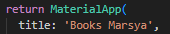
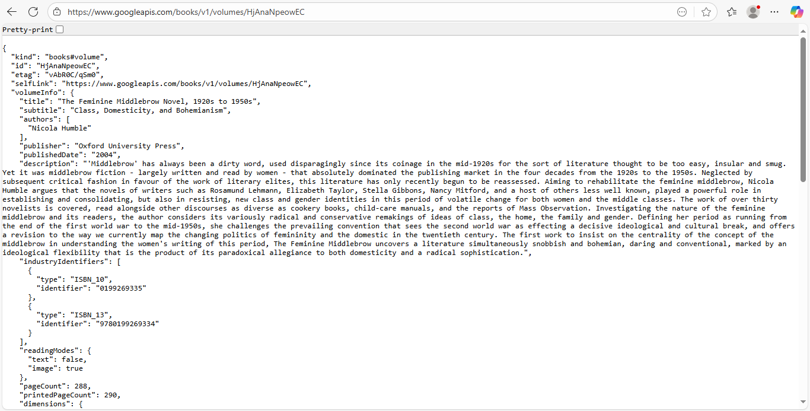
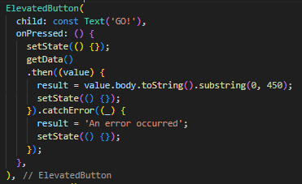
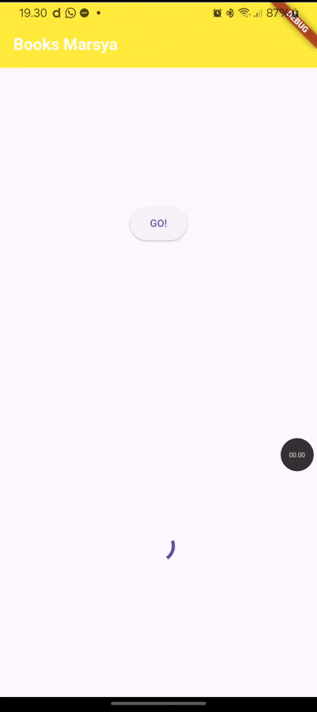

# Pemrograman Mobile Wekk 11

Nama : Marsya Aurelia Sefira

Kelas : 3G

NIM : 2341720011

# Praktikum 1 : Mengunduh Data dari Web Service (API)

Hasil Praktikum 1

# Soal 1

Tambahkan nama panggilan Anda pada title app sebagai identitas hasil pekerjaan Anda

# Soal 2

Coba akses judul buku favorit dengan URI, jika menampilkan data JSON maka telah berhasil

# Soal 3

Jelaskan maksud kode langkah 5 terkait substring dan catchError

Jawaban :

Kode langkah 5 

Pada kode diatas substring(0, 450) berarti mengambil hanya 450 karakter pertama dari teks yang akan ditampilkan.

Sedangkan catchError((_) {}) akan dijalankan jika getData() gagal, jadi pesan error "An error occurred" akan ditampilkan.

Capture hasil praktikum berupa GIF

# Praktikum 2 : Menggunakan await/async untuk menghindari callbacks 

Hasil praktikum 2 

# Soal 4 

Jelaskan maksud kode langkah 1 dan 2 tersebut!

Jawaban : 

Ketiga fungsi tersebut mengembalikan nilai bertipe int, tetapi secara asinkron, masing masing fungsi menunggu waktu 3 detik kemudian mengembalikan nilai int sesuai dengan yang ada didalam masing-masing fungsi tersebut, ketika dijalankan berurutan nilai yang didapatkan adalah 1+2+3 = 6 nilai 6 akan didapatkan setelah menunggu total 9 detik.

Variabel total dibuat untuk menampung hasil penjumlahan awalnya diset ke 0, kemudian fungsi returnOneAsync() dijalankan, karena async, program menunggu, kemudian await yang artinya menunggu hingga hasilnya keluar terlebih dahulu, kemudian lanjut ke baris berikutnya dan menyimpan nilai ke variabel total, pada bagian setState mengubah nilai result menjadi string jadi dari angka 6 diubah ke teks '6'.

Capture hasil praktikum berupa gif

# Praktikum 3 : Menggunakan completer di future

# Soal 5

Jelaskan maksud kode langkah 2 tersebut!

Jawaban : 

Kode diatas mendeklarasikan variabel completer, tetapi belum diinisialisasi, kemudian pada fungsi getNumber() membuat sebuah completer baru yang bisa menyelesaikan future<int>, kemudian langsung memanggil fungsi calculate yang menunggu terlebih dahulu 5 detik sebelum memberikan hasil 42 yag sudah ada didalam complete(42)

Capture hasil praktikum berupa gif

