# Pemrograman Mobile Wekk 11

Nama : Marsya Aurelia Sefira

Kelas : 3G

NIM : 2341720011

# Praktikum 1 : Mengunduh Data dari Web Service (API)

Hasil Praktikum 1

# Soal 1

Tambahkan nama panggilan Anda pada title app sebagai identitas hasil pekerjaan Anda

Jawaban : 

# Soal 2

Coba akses judul buku favorit dengan URI, jika menampilkan data JSON maka telah berhasil

Jawaban : 

# Soal 3

Jelaskan maksud kode langkah 5 terkait substring dan catchError

Jawaban :

Kode langkah 5 

Pada kode diatas substring(0, 450) berarti mengambil hanya 450 karakter pertama dari teks yang akan ditampilkan.

Sedangkan catchError((_) {}) akan dijalankan jika getData() gagal, jadi pesan error "An error occurred" akan ditampilkan.

Capture hasil praktikum berupa GIF

# Praktikum 2 : Menggunakan await/async untuk menghindari callbacks 

Hasil praktikum 2 

# Soal 4 

Jelaskan maksud kode langkah 1 dan 2 tersebut!

Jawaban : 

Ketiga fungsi tersebut mengembalikan nilai bertipe int, tetapi secara asinkron, masing masing fungsi menunggu waktu 3 detik kemudian mengembalikan nilai int sesuai dengan yang ada didalam masing-masing fungsi tersebut, ketika dijalankan berurutan nilai yang didapatkan adalah 1+2+3 = 6 nilai 6 akan didapatkan setelah menunggu total 9 detik.

Variabel total dibuat untuk menampung hasil penjumlahan awalnya diset ke 0, kemudian fungsi returnOneAsync() dijalankan, karena async, program menunggu, kemudian await yang artinya menunggu hingga hasilnya keluar terlebih dahulu, kemudian lanjut ke baris berikutnya dan menyimpan nilai ke variabel total, pada bagian setState mengubah nilai result menjadi string jadi dari angka 6 diubah ke teks '6'.

Capture hasil praktikum berupa gif

# Praktikum 3 : Menggunakan completer di future

# Soal 5

Jelaskan maksud kode langkah 2 tersebut!

Jawaban : 

Kode diatas mendeklarasikan variabel completer, tetapi belum diinisialisasi, kemudian pada fungsi getNumber() membuat sebuah completer baru yang bisa menyelesaikan future<int>, kemudian langsung memanggil fungsi calculate yang menunggu terlebih dahulu 5 detik sebelum memberikan hasil 42 yag sudah ada didalam complete(42)

Capture hasil praktikum berupa gif

# Soal 6

Jelaskan maksud perbedaan kode langkah 2 dengan langkah 5-6 tersebut!

Jawaban : 

Kode langkah 2

Kode Langkah 5

Kode Langkah 6

Perbedaan dari kode langkah 2 dengan kode langkah 5 dan 6 adalah langkah 2 hanya mengerjakan proses sukses, tidak ada error handling, jadi kalau error progra bisa crash dan future tidak akan selesai. Sedangkan pada langkah 5-6 sudah ditambahkan try-catch dan callback untuk handling error, dan error ditangani dengan aman, jadi bisa diketahu sukses atau gagalnya, jika gagal maka akan ditampilkan pesan errornya.

Capture hasil praktikum berupa gif

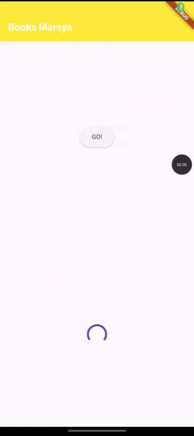

# Praktikum 4 : Memanggil Future secara paralel

# Soal 7

Capture hasil praktikum berupa gif

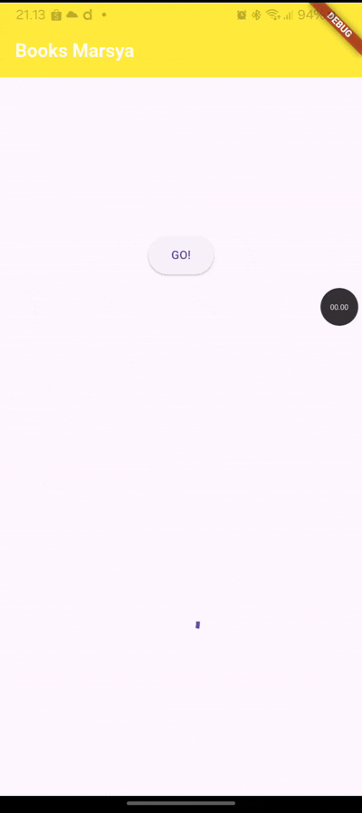

Setelah melakukan perubahan pada kode yakni memanggil future secara paralel yakni menggunakan future group seperti ini 

, semua future akan dijalankan bersamaan, output yang dihasilkan hanya memakan waktu 3 detik bukan 9 detik karena future dijalankan bersamaan tidak satu persatu seperti sebelumnya.

# Soal 8

Jelaskan perbedaan kode langkah 1 dan 4!

Jawaban : 

Kode langkah 1

Kode langkah 2

Perbedaannya adalah dengan menggunakan future wait tidak dapat menambah future secara dinamis, lebih sederhana, jumlah future harus pasti dan tetap, tetpai jika menggunakan future group bisa menambah future dinamis, dan tidak wajib memiliki jumlah future tetap. 

# Praktikum 5 : Menangani Respon Error pada Async Code

# Soal 9

Menampilkan output dari returnError

Capture hasil praktikum berupa gif

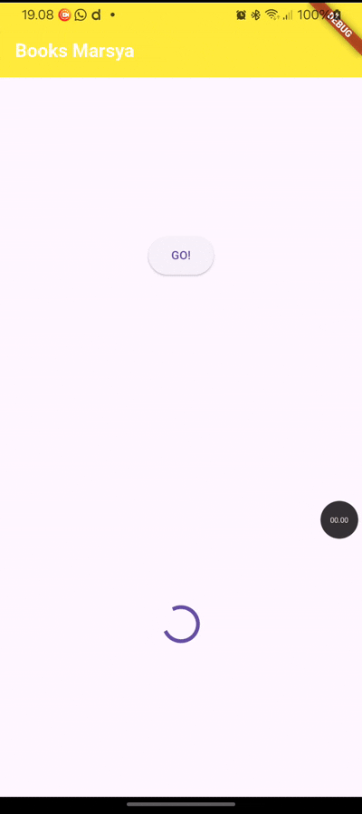

# Soal 10

Panggil method handleError() di ElevatedButton

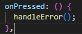

Hasil saat di run 

Hasil praktikum dalam bentuk gif

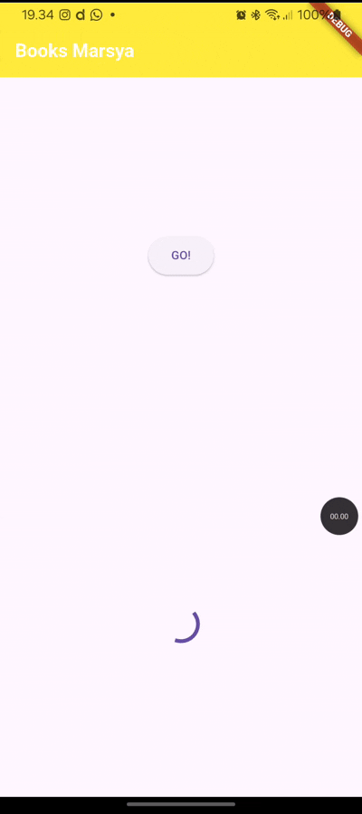

Perbedaan kode langkah 1 dan 4

Kode langkah 1

Kode langkah 4

Perbedaan kedua kode tersebut adalah pada kode pertama fungsi retrunError hanya membuat error, dan melempar exception setelah 2 detik, sedangkan kode langkah 4 handleError berfungsi untuk menangkap error, menangani exception dari returnError menggunakan try catch finally.

# Praktikum 6 : Menggunakan future dengan statefulwdidget

# Soal 11

Menambahkan nama panggilan pada properti title sebagai identitas pekerjaan saya

Jawaban : 

# Soal 12

Menambahkan delay pada method getPosition()

Apakah Anda mendapatkan koordinat GPS ketika run di browser? Mengapa demikian?

Jawaban : Tidak, saat di run di browser tidak akan menampilkan koordinat GPS karena browser tidak memiliki akses langsung ke sensor GPS perangkat. Berbeda ketika dijalankan di Android dapat menampilkan koordinat GPS karena HP memiliki sensor lokasi GPS yang bisa diakses langsung oleh aplikasi lewat API sistem operasi Android.

Capture hasil praktikum berupa gif

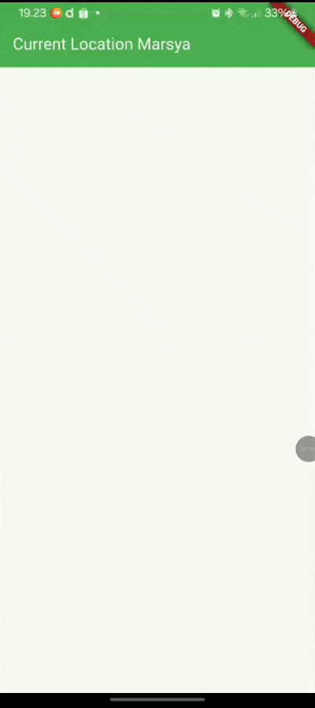

Setelah menambahkan delay pada getPosition(), aplikasi menampilkan koordinat lokasi setelah menunggu selama 3 detik.

# Praktikum 7 : Manajemen Future dengan FutureBuilder

# Soal 13 

Apakah ada perbedaan UI dengan praktikum sebelumnya Mengapa demikian?

Jawaban:

Saat pertama kali UI akan menampilkan loading, setelah data lokasi berhasil diambil UI otomatis berubah menampilkan hasil Position, transisi loading dilakukan otomatis berdasarkan state Future tanpa setState manual, pada kode sebelumnya tidak menampilkan loading, sedangkan dengan perubahan menggunakan FutureBuilder ini menampilkan loading dulu kemudian menampilkan koordinat lokasi.

Capture hasil praktikum berupa gif

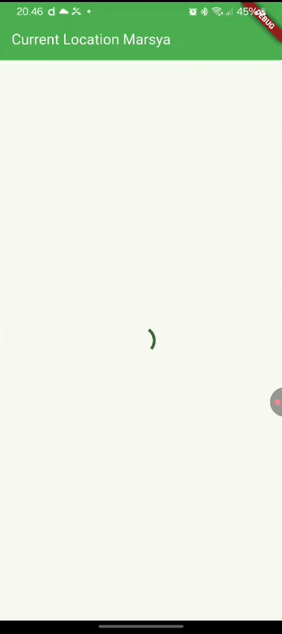

# Soal 14

Apakah ada perbedaan UI dengan langkah sebelumnya? Mengapa demikian?

Jawaban : Tidak ada perubahan UI karena perubahan kode tersebut hanya berfungsi untuk menangani error, bukan mengubah tampilan utama widgetnya.

Capture hasil praktikum berupa gif

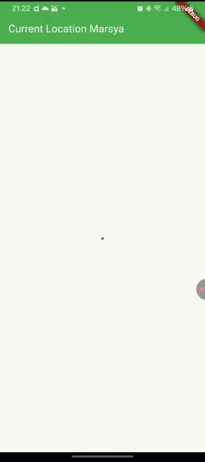

# Praktikum 8 : Navigation route dengan Future Function

# Soal 15

Tambahkan nama panggilan pada properti title sebagai identitas

# Soal 16

Mencoba klik setiap button, apa yang terjadi? Mengapa demikian?

Jawaban : Saat menekan tombol, halaman kedua tertutup dan mengirimkan warna ke halaman pertama. Jadi ketika klik pilih warna, kemudian memilih salah satu warna, warna backgroundnya langsung berubah sesuai dengan warna yang dipilih. Hal ini terjadi karena Navigator.push()membuka halaman baru dan menunggu hasil menggunakan await, kemudian Navigator.pop() menutup halaman itu dengan mengirim data balik ke halaman sebelumnya.

Mengganti 3 warna pada langkah 5 dengan warna favorit

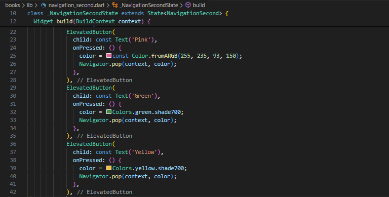

Capture hasil praktikum berupa gif

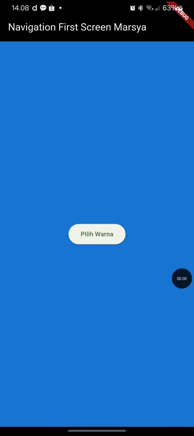

# Praktikum 9 : Memanfaatkan async/await dengan widget dialog

# Soal 17

Mencoba klik setiap button, apa yang terjadi? Mengapa demikian?

Jawaban : yang terjadi saat button di klik adalah muncul dialog untuk memilih pilihan warna yang ada, kemudian ketika klik salah satu pilihan warna, maka dialog tertutup, dan warna background layar akan berubah sesuai dengan warna yang dipilih, karena Navigator.pop() mengembalikan data ke fungsi await showDialog() lalu setState() memperbarui UI nya.

Mengganti 3 warna pada langkah 3 dengan warna favorit

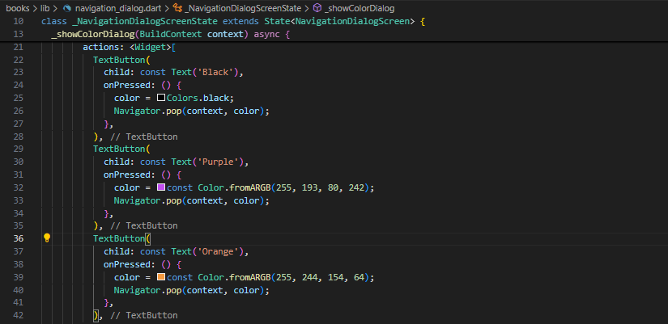

Capture hasil praktikum berupa gif

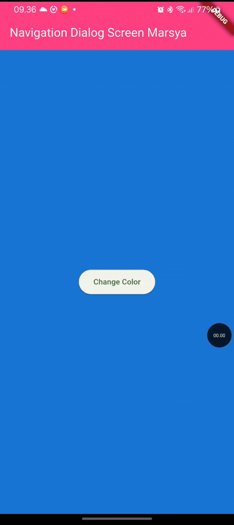

