# Pemrograman Mobile Week 12

Nama : Marsya Aurelia Sefira

Kelas : 3G

NIM : 2341720011

# Praktikum 1 : Dart Streams

# Soal 1

Tambahkan nama panggilan pada title app sebagai identitas pekerjaan 

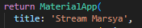

Ganti warna tema aplikasi dengan warna kesukaan

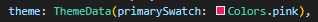

# Soal 2

Tambahkan 5 warna lainnya sesuai keinginan pada variabel colors

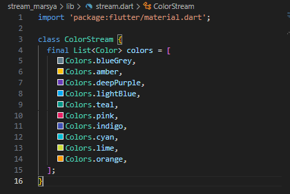

# Soal 3 

Jelaskan fungsi keyword yield* pada kode tersebut!

Jawaban : keyword yield* digunakan untuk meneruskan seluruh nilai dari stream lain ke dalam stream saat ini, jadi seluruh data yang dihasilkan oleh Stream.periodic akan diteruskan langsung ke stream utama getColors()

Apa maksud isi perintah kode tersebut?

Jawaban : kode tersebut menghasilkan warna baru setiap 1 detik, mengambil warna dari daftar colors secara bergantian. Fungsi getColors() mengembalikan aliran warna yang terus berubah setiap detik, dan berulang sesuai daftar warna yang tersedia.

# Soal 4

Capture hasil praktikum berupa gif

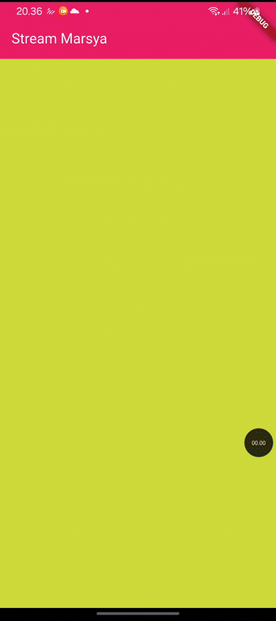

# Soal 5

Jelaskan perbedaan menggunakan listen dan await for (langkah 9)!

Jawaban : menggunakan listen menghasilkan perubahan warna setiap detik (real-time) dan terus mengalir, tetapi ketika menggunakan await menghasilkan perubahaan warna yang menunggu tiap event (sequential).

# Praktikum 2 : Stream controllers dan sinks

# Soal 6

Jelaskan maksud kode langkah 8 dan 10 tersebut!

Jawaban : 

Kode langkah 8

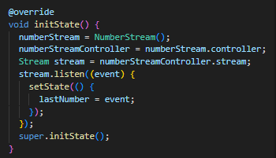

Maksud dari kode tersebut adalah untuk menghubungkan stream angka (NumberStream) dengan tampilan UI, setiap kali ada angka baru dikirim ke stream, UI akan otomatis di update lewat setState untuk menampilkan angka terbaru.

Kode langkah 10

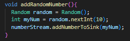

Maksud dari kode tersebut adalah fungsi addRandomNumber() digunakan untuk menghasilkan angka acak yakni 0-9 kemudian mengirimkannya ke stream agar listener yang sudah terhubung di initState() menerima event baru dan memperbarui tampilan UI dengan angka terbaru.

Capture hasil praktikum berupa gif

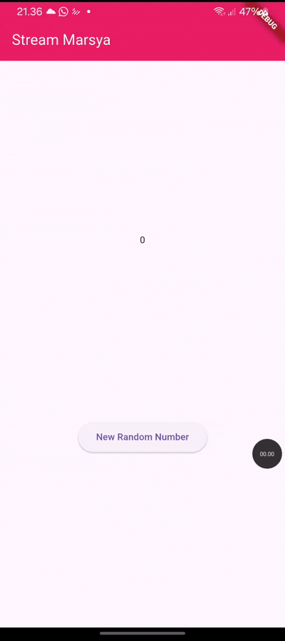

# Soal 7 

Jelaskan maksud kode langkah 13 sampai 15 tersebut!

Jawaban : 

Kode langkah 13

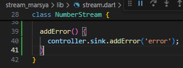

Maksud dari kode diatas adalah mengirimkan sebuah error event ke dalam stream, yakni untuk memberikan sinyal bahwa terjadi kesalahan.

Kode langkah 14

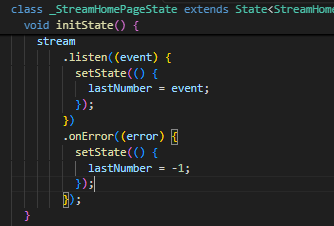

Kode tersebut adalah cara widget menerima dan bereaksi terhadap data atau error yang dikirim secara real-time dari StreamController.

Kode langkah 15

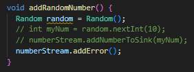

Kode diatas berfungsi untuk memuat objek random, yang bisa digunakan untuk menghasilkan angka acak, kemudian pada numberStream.addError() dia memanggil fungsi addError() yang berarti mengirim error ecvent ke stream, bukan data biasa.

# Praktikum 3 : Injeksi data ke streams

# Soal 8 

Jelaskan maksud kode langkah 1-3 tersebut!

Jawaban : 

Kode langkah 1

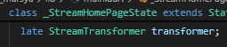

Variabel pada kode diatas adalah untuk menampung logika transformasi data pada stream, tetapi nilainya akan diinisialisasi nanti.

Kode langkah 2

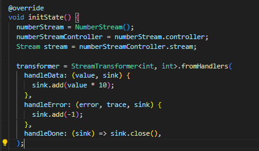

Kode diatas digunakan untuk membuat transformer untuk memodifikasi data sebelum diteruskan ke listener, setiap data yang masuk ke stream akan dikalikan 10, kemudian dikirim lagi ke listener, jadi angka acaknya adalah kelipatan 10, kemudian terdapat handle error, jika stream mengirim error, maka bukan crash tetapi mengirim nilai -1, kemudan handleDone dipanggil ketika stream selesai, dan kemudian stream ditutup oleh sink.close()

Kode langkah 3

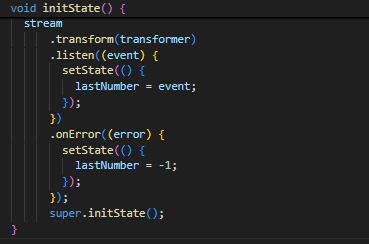

Kode diatas dignakan untuk bagian mendengarkan hasil stream yang sudah di transformasi, data stream akan diproses dulu melewati transformer sebeum dikirim ke listener, kemudian memanggil listen((event)) setiap kali ada data baru, lalu dalam setState(), nilai last number diperbarui dengan data / event terbaru, sehingga UI juga ikut berubah, kemudian terdapat onErrror untuk menangani error.

Capture hasil praktikum berupa gif

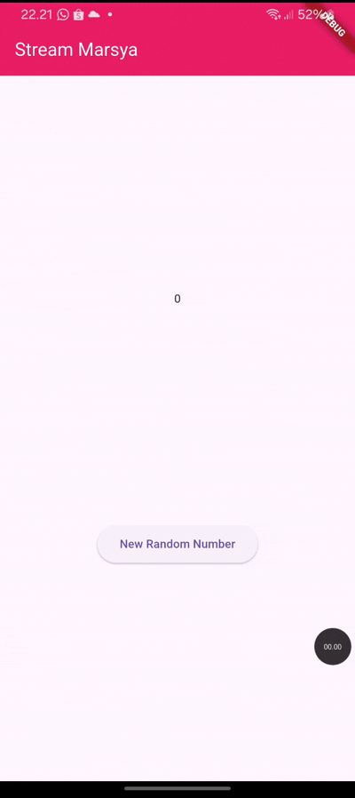

# Praktikum 4 : Subscribe ke stream events

# Soal 9

Jelaskan maksud kode langkah 2, 6 dan 8 tersebut!

Jawaban : 

Kode langkah 2

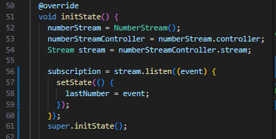

Kode diatas membuat stream (NumberStream), kemudian mendengarkan data yang masuk ke stream (listen()) kemudian mengupdate tampilan UI setiap kali ada data baru.

Kode langkah 6

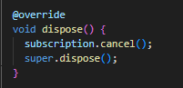

Kode ini memastikan bahwa stream listener dihentikan dengan aman saat widget tertutup, tidak ada data yang dikirim ke widget yang sudah hilang, serta aplikasi tetap berfungsi dan tidak error

Kode langkah 8

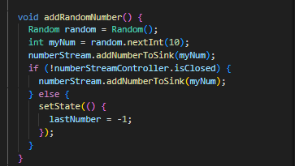

Kode diatas digunakan untuk menghasilkan angka acak baru, kemudian mengirim angka tersebut ke stream, dan ketika tombol stop subscription di klik, maka tidak dapat meminta angka acak lagi, karena stream dihentikan.

Capture hasil praktikum berupa gif

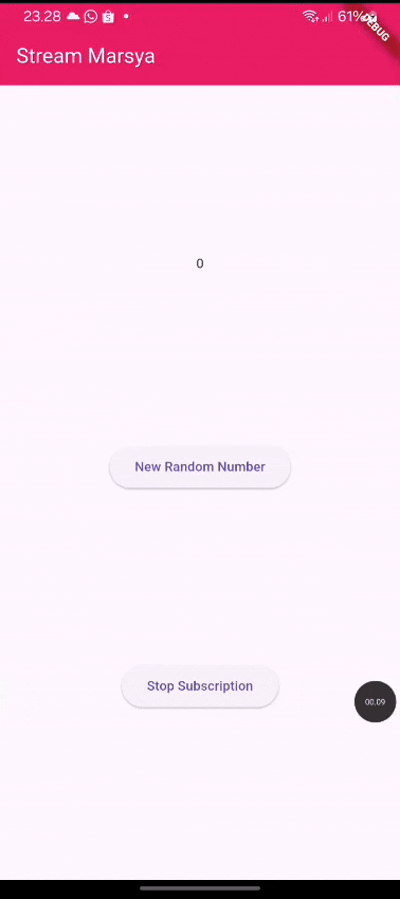

Ketika tombol stop subscription di klik maka akan muncul seperti ini

