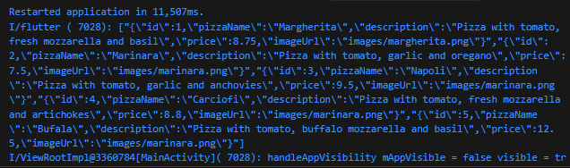

# Pemrograman Mobile Week 13

Nama : Marsya Aurelia Sefira

Kelas : 3G

NIM : 2341720011

# Praktikum 1 : Konversi Dart model ke JSON

# Soal 1

Tambahkan nama panggilan pada title app 

Mengganti warna tema aplikasi dengan warna kesukaan

# Soal 2

Capture hasil praktikum 

# Soal 3 

Capture hasil praktikum

List objek Pizza dikonversi menjadi JSON String

# Praktikum 2 : Handle kompatibilitas data JSON

# Soal 4 

Capture hasil running aplikasi 

Tidak ada data null yang ditampilkan

