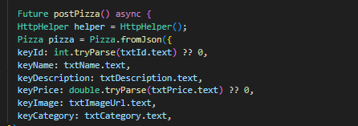
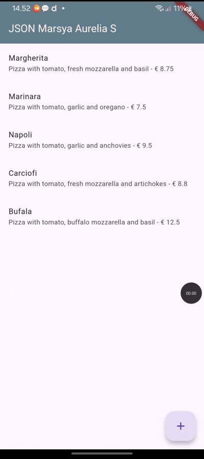

# Pemrograman Mobile Week 14

Nama : Marsya Aurelia Sefira

Kelas : 3G

NIM : 2341720011

# Praktikum 1 : Membuat layanan Mock API

# Soal 1

Menambah nama panggilan sebagai identitas

Mengganti warna dengan warna kesukaan

Capture hasil praktikum 

# Praktikum 2 : Mengirim Data ke Web Service (POST)

Menambahkan field baru dalam JSON maupun POST ke Wiremock!

Capture hasil praktikum berupa gif

